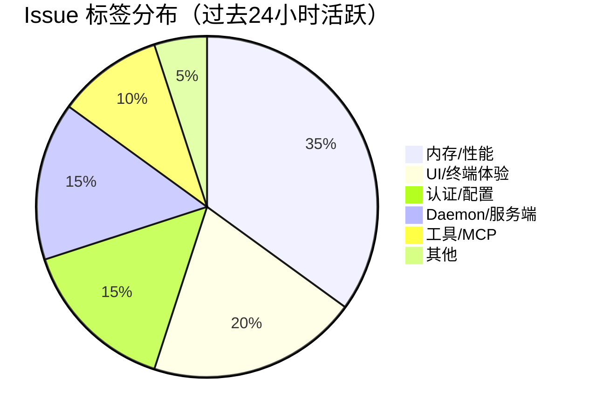

# AI CLI 工具社区动态日报 2026-05-23

> 生成时间: 2026-05-22 16:02 UTC | 覆盖工具: 9 个

- [Claude Code](https://github.com/anthropics/claude-code)
- [OpenAI Codex](https://github.com/openai/codex)
- [Gemini CLI](https://github.com/google-gemini/gemini-cli)
- [GitHub Copilot CLI](https://github.com/github/copilot-cli)
- [Kimi Code CLI](https://github.com/MoonshotAI/kimi-cli)
- [OpenCode](https://github.com/anomalyco/opencode)
- [Pi](https://github.com/badlogic/pi-mono)
- [Qwen Code](https://github.com/QwenLM/qwen-code)
- [DeepSeek TUI](https://github.com/Hmbown/DeepSeek-TUI)
- [Claude Code Skills](https://github.com/anthropics/skills)

---

## 横向对比

# AI CLI 工具生态横向对比分析报告 | 2026-05-23

---

## 1. 生态全景

当前 AI CLI 工具生态呈现**"三超多强"格局**：Claude Code、OpenAI Codex、GitHub Copilot CLI 凭借企业背书占据主流心智，但均面临 Windows 平台支持滞后、认证系统脆弱、Agent 可靠性不足等共性瓶颈。与此同时，Gemini CLI、Qwen Code、Kimi CLI 等追赶者正通过差异化架构（如 Gemini 的 AST 感知、Qwen 的 Daemon 模式）寻求突破。整体行业已从**功能竞赛**转向**生产级稳定性攻坚**——内存管理、会话持久化、MCP 故障隔离成为所有项目的共同关卡。

---

## 2. 各工具活跃度对比

| 工具 | 今日 Issues | 今日 PR | 版本发布 | 核心动态 |
|:---|:---:|:---:|:---|:---|
| **Claude Code** | 10 条热点 | 10 条（4 关闭/6 开放） | v2.1.148 紧急热修复 | Bash 工具回归缺陷修复；印度定价、认证稳定性持续发酵 |
| **OpenAI Codex** | 10 条热点 | 10 条（4 关闭/6 开放） | rust-v0.133.0 | Goals 默认启用；上下文指示器消失、Windows 冻结引发集中投诉 |
| **Gemini CLI** | 10 条热点 | 10 条 | v0.44.0-preview.0 / v0.43.0 稳定版 | 3 个 P1 PR 紧急修复会话恢复；Vertex AI 工具识别修复 |
| **GitHub Copilot CLI** | 10 条热点 | 0 条 | v1.0.52-0/1 双版本 | 延迟工具加载、日志清理；MCP 认证竞态、Windows 路径问题激增 |
| **Kimi CLI** | 5 条 | 3 条 | 无 | MCP 单点故障、Agent 循环执行；Python→TypeScript 重构争议 |
| **OpenCode** | 10 条热点 | 10 条 | 无（v1.15.x 迭代中） | 50 Issues/50 PR 极高活跃度；语音输入、自主 `/goal` 功能受追捧 |
| **Pi** | 10 条热点 | 10 条 | v0.74.2 热修复 | Node 版本迁移、Windows 稳定性专项；本地 LLM 支持长期高票 |
| **Qwen Code** | 10 条热点 | 10 条 | v0.16.0-nightly（发布失败） | OOM 内存问题集群爆发；Daemon 模式、诊断框架推进 |
| **DeepSeek TUI** | 10 条热点 | 10 条（2 关闭/8 开放） | 无 | Hook 生命周期架构提案；图片 URL 附件、Pro Plan 模型路由评审 |

> **注**："今日"指 2026-05-23 日报覆盖周期，部分工具为 24 小时内更新，部分为近期活跃聚合。

---

## 3. 共同关注的功能方向

| 功能方向 | 涉及工具 | 具体诉求 | 紧迫度 |
|:---|:---|:---|:---:|
| **Agent 可靠性/可控性** | Claude Code、Gemini CLI、Kimi CLI、Qwen Code、DeepSeek TUI | 子 Agent 超时机制（#61405）、MAX_TURNS 误报成功（#22323）、循环执行（#2142）、Cancel/Pause/Resume 统一语义（#1917） | ⭐⭐⭐⭐⭐ |
| **Windows 平台平等化** | Claude Code、OpenAI Codex、Copilot CLI、Pi、Qwen Code | ARM64 启动失败（#40198）、TUI 冻结（#23981）、PowerShell 工具 ENOENT（#2355）、Defender 锁死（#4756）、路径断裂（#4873） | ⭐⭐⭐⭐⭐ |
| **会话持久化与恢复** | Gemini CLI、DeepSeek TUI、Pi、Claude Code | `--resume` 崩溃（#27371）、PTY FD 泄漏（#27154）、回退点错乱（#25646）、技能展开后不可读（#4800） | ⭐⭐⭐⭐⭐ |
| **MCP 生态健壮性** | Claude Code、Copilot CLI、Kimi CLI | OAuth 端口竞态（#3462）、并发刷新令牌冲突（#3456）、单点超时拖垮整体（#2343）、尾部斜杠破坏 Entra ID（#52871） | ⭐⭐⭐⭐☆ |
| **上下文/Token 透明度** | OpenAI Codex、Claude Code、OpenCode | 用量指示器消失（#23794）、Max 订阅者指标不可见（#1109）、成本计算错误（#28836） | ⭐⭐⭐⭐☆ |
| **认证系统稳定性** | Claude Code、Copilot CLI、OpenCode | 强制每日重新登录（#1757）、OAuth 重定向死循环（#19160）、SSO 手机号强制绑定（#20161） | ⭐⭐⭐⭐☆ |
| **本地/私有化部署** | Pi、Qwen Code | 本地 LLM 原生支持（#3357）、Mode B Daemon 生产化（#4175）、企业代理配置（#4797） | ⭐⭐⭐☆☆ |

---

## 4. 差异化定位分析

| 工具 | 功能侧重 | 目标用户 | 技术路线特征 |
|:---|:---|:---|:---|
| **Claude Code** | Agent 深度编排、代码审查工作流 | 专业开发者、团队工程效能 | 闭源；Sonnet/Haiku 模型分层；`CLAUDE.md` 项目知识沉淀；后台会话持久化 |
| **OpenAI Codex** | 目标追踪（Goals）、远程控制生态 | OpenAI 生态深度用户、跨设备开发者 | Rust 核心 + TUI 前端；GPT-5.5 模型独占；Goals 状态机持久化 |
| **Gemini CLI** | AST 感知工具、Vertex AI 企业集成 | Google Cloud 用户、大代码库维护者 | TypeScript/Node；实验性 AST 工具（#22745）；Auto Memory 自动技能 |
| **GitHub Copilot CLI** | IDE 无缝衔接、组织策略管控 | GitHub 生态企业用户、VS Code 用户 | 闭源；延迟工具加载优化大型 Agent；与 Copilot 席位体系深度绑定 |
| **Kimi CLI** | 前端生态集成（RTK/Vite）、跨端协同 | 中国前端开发者、React 技术栈 | Python→TypeScript/Bun 重构中；MCP 扩展机制；Web-CLI 状态层待统一 |
| **OpenCode** | 语音交互、自主任务、多模型兼容 | 早期采纳者、AI 原生交互探索者 | 开源；Effect 函数式架构；SQLite 核心；快速迭代功能实验 |
| **Pi** | 多提供商统一、本地模型、成本优化 | 多模型策略用户、自托管需求者 | TypeScript；懒加载工具 schema（#4822）；session 路由优化缓存 |
| **Qwen Code** | Daemon 服务端模式、诊断框架、Telemetry | 中国开发者、企业私有化部署 | Node.js；流驱动工具调度；ring buffer 诊断；子 Agent Span 隔离 |
| **DeepSeek TUI** | 终端原生体验、权限策略工程、模型路由 | 终端重度用户、DeepSeek 模型用户 | Rust + ratatui；execpolicy 权限引擎；Pro Plan "慢思考-快执行"成本优化 |

---

## 5. 社区热度与成熟度

### 社区活跃度梯队

| 梯队 | 工具 | 判断依据 |
|:---|:---|:---|
| **🔥 极高活跃** | OpenCode、Qwen Code | 单日 50 Issues + 50 PR 量级；功能实验密集；版本迭代激进 |
| **📈 高活跃** | Claude Code、OpenAI Codex、Gemini CLI、Pi、DeepSeek TUI | 10-20 级 Issues/PR 日更；企业团队驱动，发布节奏稳定 |
| **⚖️ 中等活跃** | Kimi CLI、Copilot CLI | 5-10 级日更；Copilot CLI 今日 PR 为零显示社区贡献偏低，Kimi 重构期讨论集中 |

### 成熟度评估

| 维度 | 最成熟 | 快速追赶 | 仍需验证 |
|:---|:---|:---|:---|
| **发布稳定性** | Claude Code（热修复响应快） | Gemini CLI（P1 修复密集） | Qwen Code（v0.16.0 发布失败）、OpenCode（v1.15.x 连续回归） |
| **跨平台支持** | Pi（Windows 专项投入） | — | Claude Code、Codex、Copilot CLI（Windows 均为二等公民） |
| **Agent 可靠性** | — | DeepSeek TUI（Hook 生命周期提案）、Qwen Code（流驱动调度） | 全部工具均存在子 Agent 失控、无限挂起报告 |
| **企业就绪度** | Copilot CLI（组织策略、席位体系） | Gemini CLI（Vertex AI）、Qwen Code（Daemon 模式） | OpenCode、Kimi CLI（计费透明度、凭证管理薄弱） |

---

## 6. 值得关注的趋势信号

### 🔮 架构趋势

| 信号 | 证据 | 开发者参考价值 |
|:---|:---|:---|
| **Agent 控制平面标准化** | DeepSeek TUI #1917 通用 Hook 层、Qwen Code #4402 流驱动调度、Claude Code #61405 超时诉求 | 长时 Agent 任务的 Cancel/Pause/Resume 将成为 CLI 标配能力，设计时需预留控制接口 |
| **"慢思考-快执行"模型路由** | DeepSeek TUI #1865 Pro Plan、Codex #22099 并行子代理提案 | 成本优化从"选便宜模型"转向"任务分阶段路由"，推理成本可降 5-10 倍 |
| **诊断框架内置化** | Qwen Code #4421 ring buffer、Pi #4829 计时点清理 | 生产环境故障排查从"开 debug 复现"转向"运行时轻量捕获"，降低用户上报门槛 |

### 🛡️ 工程趋势

| 信号 | 证据 | 开发者参考价值 |
|:---|:---|:---|
| **MCP 故障隔离成刚需** | Kimi #2343 单超时拖垮整体、Claude Code #52871 OAuth 细节破坏集成 | 接入 MCP 时需实现超时熔断 + 服务降级，不可信任外部工具可靠性 |
| **Token 效率进入微观优化** | Pi #4822 工具 schema 懒加载（省 54% 系统提示）、Gemini #26480 精准 edit 工具 | 大上下文窗口≠无限使用，schema 压缩、AST 感知读取将成为差异化能力 |
| **会话状态机复杂度爆炸** | Gemini `--resume` 系列 4 个 P1、DeepSeek TUI #1913 任务残留、Pi #4800 技能展开 | 长期会话的"恢复一致性"是未充分解决的难题，设计时需状态版本化 |

### 🌍 生态趋势

| 信号 | 证据 | 开发者参考价值 |
|:---|:---|:---|
| **区域定价倒逼全球化** | Claude Code #17432 印度 INR 呼声 391👍、Kimi 国内生态聚焦 | 新兴市场开发者对 USD 定价敏感度极高，工具出海需本地化支付基础设施 |
| **开源闭源博弈加剧** | Copilot CLI #3241 开源诉求、OpenCode 快速功能迭代 | 企业用户对审计和私有部署需求上升，闭源工具需证明差异化价值 worth 锁定 |
| **终端原生体验复兴** | DeepSeek TUI ratatui 重度投入、Codex TUI 持续优化、语音输入（OpenCode #4695 150👍） | TUI 不是"降级版 GUI"，而是 AI 交互的新原生形态，终端能力决定用户留存 |

---

*报告基于 2026-05-23 各工具社区公开数据生成，覆盖 9 个主流 AI CLI 项目。*

---

## 各工具详细报告

<details>
<summary><strong>Claude Code</strong> — <a href="https://github.com/anthropics/claude-code">anthropics/claude-code</a></summary>

## Claude Code Skills 社区热点

> 数据来源: [anthropics/skills](https://github.com/anthropics/skills)

# Claude Code Skills 社区热点报告（2026-05-23）

---

## 1. 热门 Skills 排行（按社区关注度）

| 排名 | Skill | 功能概述 | 状态 | 链接 |
|:---|:---|:---|:---|:---|
| 1 | **document-typography** | AI 生成文档的排版质量控制：修复孤行、寡行、编号错位等排版问题 | 🟡 Open | [PR #514](https://github.com/anthropics/skills/pull/514) |
| 2 | **ODT** | OpenDocument 格式（.odt/.ods）的创建、模板填充、ODT↔HTML 转换 | 🟡 Open | [PR #486](https://github.com/anthropics/skills/pull/486) |
| 3 | **frontend-design**（改进版） | 提升前端设计 Skill 的可执行性，确保每条指令在单轮对话内可完成 | 🟡 Open | [PR #210](https://github.com/anthropics/skills/pull/210) |
| 4 | **skill-quality-analyzer / skill-security-analyzer** | 元 Skill：对现有 Skill 进行五维度质量评估与安全审计 | 🟡 Open | [PR #83](https://github.com/anthropics/skills/pull/83) |
| 5 | **SAP-RPT-1-OSS** | 集成 SAP 开源表格基础模型，用于 SAP 业务数据的预测分析 | 🟡 Open | [PR #181](https://github.com/anthropics/skills/pull/181) |
| 6 | **testing-patterns** | 全栈测试体系：测试哲学、单元测试、React 组件测试、E2E、CI 集成 | 🟡 Open | [PR #723](https://github.com/anthropics/skills/pull/723) |
| 7 | **AppDeploy** | 直接从 Claude 部署全栈 Web 应用到公共 URL（集成 AppDeploy.ai） | 🟡 Open | [PR #360](https://github.com/anthropics/skills/pull/360) |
| 8 | **sensory** | 原生 macOS 自动化：通过 AppleScript/osascript 替代截图式 Computer Use | 🟡 Open | [PR #806](https://github.com/anthropics/skills/pull/806) |

**讨论热点**：文档排版（#514）和开放文档格式（#486）反映企业对 AI 生成文档专业度的刚性需求；testing-patterns（#723）填补测试领域空白；sensory（#806）探索本地自动化新范式，规避 Computer Use 的延迟与脆弱性。

---

## 2. 社区需求趋势（Issues 提炼）

| 需求方向 | 代表 Issue | 核心诉求 |
|:---|:---|:---|
| **组织级 Skill 共享** | [#228](https://github.com/anthropics/skills/issues/228) | 企业内 Skill 库共享，替代手动传文件+逐个上传的低效流程 |
| **Skill 标准化与治理** | [#202](https://github.com/anthropics/skills/issues/202), [#412](https://github.com/anthropics/skills/issues/412) | skill-creator 需符合最佳实践；需要 Agent 治理模式（策略执行、威胁检测、审计追踪） |
| **MCP 协议互通** | [#16](https://github.com/anthropics/skills/issues/16) | 将 Skills 暴露为 MCP Server，实现算法艺术等 Skill 的标准化 API 调用 |
| **云服务商兼容** | [#29](https://github.com/anthropics/skills/issues/29) | AWS Bedrock 等第三方模型托管平台的 Skill 支持 |
| **安全与信任边界** | [#492](https://github.com/anthropics/skills/issues/492) | 社区 Skill 滥用 `anthropic/` 命名空间，导致用户误授高权限 |
| **上下文窗口优化** | [#1102](https://github.com/anthropics/skills/issues/1102) | MCP 返回大数据量时的工程压缩方案，避免上下文拥塞 |
| **插件加载精确控制** | [#189](https://github.com/anthropics/skills/issues/189), [#1087](https://github.com/anthropics/skills/issues/1087) | 插件应仅加载声明的 Skill，避免重复加载全量仓库内容 |

---

## 3. 高潜力待合并 Skills（评论活跃 + 解决明确痛点）

| Skill | 核心价值 | 关键进展 | 链接 |
|:---|:---|:---|:---|
| **document-typography** | 解决"所有 Claude 生成文档"的通用排版缺陷，用户很少主动要求好排版但始终受害 | 2026-03 创建，持续迭代 | [PR #514](https://github.com/anthropics/skills/pull/514) |
| **testing-patterns** | 填补社区测试体系空白，覆盖从单元测试到 CI 的完整链条 | 2026-03-22 提交，4 月更新 | [PR #723](https://github.com/anthropics/skills/pull/723) |
| **sensory** | 为 macOS 用户提供原生自动化替代方案，性能与稳定性优于视觉 Computer Use | 双层权限设计已明确 | [PR #806](https://github.com/anthropics/skills/pull/806) |
| **ServiceNow** | 企业 ITSM/ITOM/SecOps 全平台覆盖，单一 Skill 替代多个垂直工具 | 2026-03-08 提交，4 月持续更新 | [PR #568](https://github.com/anthropics/skills/pull/568) |
| **AURELION 套件** | 认知框架+记忆系统的结构化知识管理，含 kernel/advisor/agent/memory 四层 | 2026-02-21 提交，5 月更新 | [PR #444](https://github.com/anthropics/skills/pull/444) |
| **n8n-builder / n8n-debugger** | 工作流自动化领域（n8n）的构建与调试双 Skill，生产环境验证 | 2025-12 提交，2026-05-18 最新更新 | [PR #190](https://github.com/anthropics/skills/pull/190) |

> **注**：多个高价值 PR 评论数显示为 `undefined`，可能因 API 限制未完全采集，但创建时间与更新频率显示社区持续投入。

---

## 4. Skills 生态洞察

> **当前社区最集中的诉求：从"个人效率工具"向"企业级可治理、可共享、可审计的生产力基础设施"跃迁**——组织级 Skill 分发（#228）、安全信任边界（#492）、Agent 治理框架（#412）、MCP 标准化互通（#16）四大议题同步涌现，标志着 Skills 生态进入企业采纳的关键拐点。

---

*数据截止：2026-05-23 | 来源：github.com/anthropics/skills*

---

# Claude Code 社区动态日报 | 2026-05-23

## 今日速览

Anthropic 今日紧急发布 v2.1.148 修复 Bash 工具回归缺陷；社区持续热议印度区定价（#17432 近 400 👍）与认证稳定性问题。Agent 系统可靠性与 Windows 平台兼容性成为开发者反馈的两大核心痛点。

---

## 版本发布

### [v2.1.148](https://github.com/anthropics/claude-code/releases/tag/v2.1.148) — 紧急热修复
- **关键修复**：解决 Bash 工具对所有用户返回 exit code 127 的严重回归问题（由 v2.1.147 引入）

### [v2.1.147](https://github.com/anthropics/claude-code/releases/tag/v2.1.147) — Agent 系统增强
- **Pinned 后台会话持久化**：`Ctrl+T` 固定的 agent 会话空闲时保持存活，更新时原地重启，内存压力下仅回收非固定会话
- **`/simplify` 更名为 `/code-review`**：扩展功能范围，新增正确性缺陷检测能力

---

## 社区热点 Issues

| # | 标题 | 状态 | 评论/👍 | 核心看点 |
|---|------|------|---------|---------|
| [#17432](https://github.com/anthropics/claude-code/issues/17432) | **印度区定价计划（INR）** | 🔴 OPEN | 168 / 391 | 社区呼声最高的商业化需求。对比 OpenAI/Google 已支持本地货币定价，USD 结算对印度开发者成本显著偏高，可能成为市场扩张瓶颈 |
| [#1757](https://github.com/anthropics/claude-code/issues/1757) | **强制每日重新登录** | 🔴 OPEN | 64 / 55 | 认证系统的长期顽疾。Max 订阅用户仍频繁遭遇网页认证弹窗，严重影响 CLI 工具的自动化工作流体验 |
| [#40198](https://github.com/anthropics/claude-code/issues/40198) | **Cowork VM 在 Windows ARM64 启动失败** | 🔴 OPEN | 47 / 4 | 高通骁龙平台（Galaxy Book4 Edge）的兼容性问题，反映 Windows on ARM 生态支持滞后于硬件迭代 |
| [#60366](https://github.com/anthropics/claude-code/issues/60366) | **"hi" 触发 Usage Policy 误报** | 🔴 OPEN | 32 / 10 | 模型安全过滤的极端误杀案例，暴露内容审核机制的过度敏感问题，影响基础交互可用性 |
| [#1109](https://github.com/anthropics/claude-code/issues/1109) | **Max 订阅者用量指标可见性** | 🔴 OPEN | 21 / 56 | 付费用户数据透明度诉求。取消用量限制后，开发者仍需要 token 计数、会话轮次等数据用于工作流优化 |
| [#19160](https://github.com/anthropics/claude-code/issues/19160) | **OAuth 重定向至定价页阻断现有 Max 用户认证** | 🔴 OPEN | 21 / 0 | 认证流程的漏斗设计缺陷，将已付费用户导向 onboarding 付费页面，形成逻辑死循环 |
| [#36797](https://github.com/anthropics/claude-code/issues/36797) | **活跃订阅账户认证重定向异常** | 🔴 OPEN | 17 / 9 | 与 #19160 症状相似的认证系统 bug，指向账户状态同步服务的可靠性问题 |
| [#53940](https://github.com/anthropics/claude-code/issues/53940) | **Cowork 编辑工具确定性截断文件** | 🔴 OPEN | 13 / 6 | 高危数据完整性缺陷。字节守恒缓冲区机制在所有文件尺寸下均可能静默截断内容，有完整复现步骤 |
| [#52871](https://github.com/anthropics/claude-code/issues/52871) | **MCP OAuth 追加斜杠破坏 Entra ID 认证** | 🔴 OPEN | 10 / 7 | 企业级 SSO 集成痛点。`resource` 参数尾部斜杠导致 AADSTS9010010 错误，影响 Microsoft 生态对接 |
| [#61405](https://github.com/anthropics/claude-code/issues/61405) | **子 Agent 委派缺乏超时与终止控制** | 🔴 OPEN | 3 / 0 | Agent 系统的可靠性设计缺陷。无超时机制导致 12+ 小时会话挂起，反映多 agent 编排的成熟度不足 |

---

## 重要 PR 进展

| # | 标题 | 状态 | 核心贡献 |
|---|------|------|---------|
| [#61373](https://github.com/anthropics/claude-code/pull/61373) | **security-guidance 插件：添加 exclude_substrings 削减误报** | 🟢 OPEN | 精准排除 `ast.literal_eval`、`db.exec` 等安全标识符的误匹配，解决 #55464 等已知问题 |
| [#60813](https://github.com/anthropics/claude-code/pull/60813) | **API 初始提示 token 过度消耗修复** | 🟢 OPEN | 声称解决 #56136 的 token 膨胀问题，但 PR 描述偏重视觉设计而非技术方案，质量存疑 |
| [#20448](https://github.com/anthropics/claude-code/pull/20448) | **Web4 治理插件：R6 审计工作流** | 🟢 OPEN | 引入 T3 信任张量与实体见证机制，为 AI 代理时代提供密码学可追溯的治理基础设施 |
| [#31974](https://github.com/anthropics/claude-code/pull/31974) | **code-review 模式学习：自动建议 CLAUDE.md 规则** | 🔴 CLOSED | 跨 PR 聚合验证问题模式，识别重复出现的规则缺口，将离散审查信号转化为知识沉淀 |
| [#31698](https://github.com/anthropics/claude-code/pull/31698) | **强化 Step 1 门控 Agent 可靠性** | 🔴 CLOSED | Haiku → Sonnet 模型升级，定义明确的跳过标准，防止"平凡 PR"误判导致审查静默丢失 |
| [#31699](https://github.com/anthropics/claude-code/pull/31699) | **code-review 添加 --model 全局覆盖** | 🔴 CLOSED | 统一覆盖各步骤的模型选择（Haiku/Sonnet/Opus），满足成本-质量偏好的灵活调配 |
| [#31690](https://github.com/anthropics/claude-code/pull/31690) | **修正 README 算法描述并补充测试** | 🔴 CLOSED | 文档与实际实现同步（置信度评分 → 验证/过滤子代理），补充 `tests/lint.sh` |
| [#31697](https://github.com/anthropics/claude-code/pull/31697) | **Step 5 验证纳入 CLAUDE.md Agent 结果** | 🔴 CLOSED | 修复合规审查静默丢失的 bug：CLAUDE.md 违规项因未进入 Step 5 验证而被 Step 6 过滤 |
| [#61478](https://github.com/anthropics/claude-code/pull/61478) | **Claude/marketing management system** | 🟢 OPEN | 内容为空，疑似 spam 或误提交 |
| [#58673](https://github.com/anthropics/claude-code/pull/58673) | **s** | 🟢 OPEN | 单字符提交，spam 嫌疑 |

> **注**：kpatel513 的 4 个 code-review 相关 PR 均于 3 月创建、昨日集中关闭，推测为功能合并或方案替换。

---

## 功能需求趋势

基于 50 条活跃 Issue 的聚类分析：

| 方向 | 热度 | 代表 Issue | 趋势解读 |
|------|------|-----------|---------|
| **区域定价与支付本地化** | 🔥🔥🔥 | #17432 (印度 INR) | 新兴市场扩张的刚需，竞品已建立标杆 |
| **认证系统稳定性** | 🔥🔥🔥 | #1757, #19160, #36797 | 高频登录、OAuth 重定向错误构成核心流失风险 |
| **Agent 编排可靠性** | 🔥🔥🔥 | #61405, #61388, #61481 | 超时控制、承诺保持、事实验证机制缺失 |
| **Windows 平台兼容性** | 🔥🔥 | #40198, #53940, #53915 | ARM64 支持、文件操作、UI 重叠问题集中 |
| **MCP 生态健壮性** | 🔥🔥 | #52871, #60428, #38437 | OAuth 协议细节、会话保活、代理层透明性 |
| **用量数据透明度** | 🔥 | #1109 | 无限制订阅≠无监控需求，开发者需要优化依据 |
| **IDE 深度集成** | 🔥 | #37354 (VS Code 标签页) | 多会话并行管理，对标 Copilot Chat 体验 |

---

## 开发者关注点

### 🔴 高频痛点

1. **认证系统的"每日骚扰"**
   - CLI 工具的核心价值在于无摩擦嵌入工作流，强制网页认证破坏自动化场景
   - Max 订阅用户遭遇与免费用户相同的认证强度，付费体验倒挂

2. **Agent 系统的"黑箱失控"**
   - 子 Agent 无超时 → 资源无限挂起（#61405）
   - 跨轮次承诺丢失 → 任务漂移（#61388）
   - 研究结果伪验证 → 事实幻觉（#61481）
   - **共性**：缺乏可观测的中间状态与强制干预机制

3. **Windows 平台的"二等公民"体验**
   - ARM64 设备（骁龙 X Elite）Cowork VM 无法启动
   - 桌面端 UI 元素重叠（Incognito ↔ 关闭按钮，#59481 等 4 个重复 Issue）
   - 文件操作工具的字节级截断风险（#53940）

4. **MCP 集成的"协议摩擦"**
   - OAuth `resource` 参数尾部斜杠的 1 字节差异阻断 Entra ID 企业认证
   - 工具会话静默失效（Slack MCP 1 小时后消失），状态报告与实际能力脱节

### 🟡 潜在机会

- **技能系统（Skills）的权限继承**：#61492 提出 `CronCreate` 触发时应用技能的允许工具列表，反映定时任务场景的安全模型细化需求
- **工作树（Worktree）的单仓库多代理**：#60871 揭示 monorepo 中子目录级 `CLAUDE.md` 的上下文隔离需求，与微前端/服务化架构趋势契合

---

*日报基于 GitHub 公开数据生成，不代表 Anthropic 官方立场。*

</details>

<details>
<summary><strong>OpenAI Codex</strong> — <a href="https://github.com/openai/codex">openai/codex</a></summary>

# OpenAI Codex 社区动态日报 | 2026-05-23

## 今日速览

今日 Codex 发布 **rust-v0.133.0**，Goals 功能正式默认启用并配备持久化存储；同时社区爆发大量关于 **Windows 平台稳定性**（冻结、ANSI 转义序列、WSL 路径问题）和 **上下文/Token 用量指示器消失**的集中反馈，开发者对透明度需求显著上升。

---

## 版本发布

### [rust-v0.133.0](https://github.com/openai/codex/releases/tag/rust-v0.133.0)

| 特性 | 说明 |
|:---|:---|
| **Goals 默认启用** | 目标追踪现配备专用存储，可跨活跃 turns 持续跟踪进度（#23300, #23685, #23696, #23732） |
| **`codex remote-control` 重构** | 以前台命令形式运行，等待就绪后报告机器状态，保留显式的 daemon 风格 `start`/`stop` 子命令 |

---

## 社区热点 Issues

### 🔴 高优先级 Bug / 回归

| # | 标题 | 状态 | 评论 | 👍 | 关键要点 |
|:---|:---|:---|:---:|:---|:---|
| [#20161](https://github.com/openai/codex/issues/20161) | 手机号验证失效（SSO 登录后强制要求未绑定的手机号） | **CLOSED** | 142 | 96 | 历史高票问题，影响多设备登录场景，昨日关闭但社区仍在追问根因 |
| [#13041](https://github.com/openai/codex/issues/13041) | WebSocket 升级成功后服务器以 1008 Policy 关闭，回退 HTTPS | OPEN | 67 | 143 | **最高票开放 issue**，Arch Linux 用户持续报告，连接层核心问题 |
| [#23794](https://github.com/openai/codex/issues/23794) | 桌面端上下文/Token 用量指示器消失 | OPEN | 57 | 81 | **v0.133.0 相关回归**，用户无法感知上下文压缩临界点 |
| [#23981](https://github.com/openai/codex/issues/23981) | Windows 应用执行操作后冻结无响应 | OPEN | 3 | 0 | 新上报，26.519.21041 版本，阻塞工作流 |
| [#23672](https://github.com/openai/codex/issues/23672) | Windows 应用启动失败：app-server websocket 异常退出 code=3221225501 | OPEN | 7 | 0 | 0xc0000005 访问冲突特征，涉及 Windows 11 25H2 兼容性 |

### 🟡 平台与生态

| # | 标题 | 状态 | 评论 | 👍 | 关键要点 |
|:---|:---|:---|:---:|:---|:---|
| [#11023](https://github.com/openai/codex/issues/11023) | 请求 Linux 桌面原生应用 | OPEN | 62 | 265 | **最高票功能请求**，Mac 功耗问题倒逼 Linux 需求 |
| [#13762](https://github.com/openai/codex/issues/13762) | Windows WSL 模式下错误使用 Windows CODEX_HOME，worktree 落盘 /mnt/c | OPEN | 27 | 38 | 跨文件系统性能灾难，WSL 用户长期痛点 |
| [#22802](https://github.com/openai/codex/issues/22802) | 移动端远程连接"Secure setup failed" | OPEN | 12 | 5 | iOS-MacOS 跨设备安全握手失败，远程开发场景阻塞 |
| [#23671](https://github.com/openai/codex/issues/23671) | Business 账号 Codex 消耗速度比 Plus 快 5-10 倍 | OPEN | 5 | 3 | **计费公平性质疑**，相同 GPT-5.5 任务下企业套餐反而更贵 |
| [#22099](https://github.com/openai/codex/issues/22099) | 提案：并行优先子代理与非阻塞后台任务管理 | OPEN | 7 | 0 | 社区 fork "Open Codex CLI" 探索方向，涉及架构级改进 |

---

## 重要 PR 进展

### 配置系统重构（Legacy Profile 清理）

| # | 标题 | 状态 | 核心内容 |
|:---|:---|:---|:---|
| [#24067](https://github.com/openai/codex/pull/24067) | app-server: 移除遗留 profile 配置表面 | OPEN | 清理 app-server 层遗留 `[profiles.<name>]` 表，统一至 `--profile <name>` 文件选择 |
| [#24076](https://github.com/openai/codex/pull/24076) | 停止消费遗留 config profiles | OPEN | 核心层拒绝 legacy `profile = "..."`，强制迁移至文件化配置 |
| [#24059](https://github.com/openai/codex/pull/24059) | 拒绝遗留 profile 选择器 | **CLOSED** | 防止 legacy selector 通过 config write 或 MCP tool 路径重新引入 |
| [#24055](https://github.com/openai/codex/pull/24055) | 移除遗留 profile 写入路径 | **CLOSED** | 清理 `active_profile` 和 `ConfigProfile` 的持久化逻辑 |
| [#24051](https://github.com/openai/codex/pull/24051) | 移除遗留 profile v1 解析 | **CLOSED** | 终结 `profile = "..."` 选择 `[profiles.<name>]` 的第二 legacy 路径 |

### 稳定性与平台修复

| # | 标题 | 状态 | 核心内容 |
|:---|:---|:---|:---|
| [#24082](https://github.com/openai/codex/pull/24082) | 修复：TUI 渲染前恢复 Windows VT 模式 | OPEN | 解决旧版 Git for Windows 导致 ANSI 转义序列裸显问题（关联 #23031, #23691） |
| [#24092](https://github.com/openai/codex/pull/24092) | 安全命令解析拒绝 PowerShell param 块 | OPEN | 防止脚本级参数块被错误展平为 argv，加固 Windows 安全路径 |
| [#24081](https://github.com/openai/codex/pull/24081) | TUI 日志改为 opt-in | OPEN | `codex-tui.log` 默认停止写入，改为显式故障排查选项，解决无界增长 |
| [#23951](https://github.com/openai/codex/pull/23951) | 远程压缩 v2 请求重试 | OPEN | 为 compaction trigger 的 `/responses` 请求添加流式重试语义，降低瞬态失败 |
| [#23823](https://github.com/openai/codex/pull/23823) | 独立 WebSearch 扩展 | OPEN | 新增 `web.run` 工具，通过 `codex-api` 搜索客户端调用独立搜索端点， gated behind `standalone_web_search` |

---

## 功能需求趋势

基于 50 条活跃 issue 的聚类分析：

| 趋势方向 | 热度 | 代表性诉求 |
|:---|:---|:---|
| **Windows 平台质量** | 🔥🔥🔥🔥🔥 | 冻结、ANSI 转义、WSL 路径、应用启动崩溃，占今日新 issue 超 40% |
| **上下文透明度** | 🔥🔥🔥🔥🔥 | Token 用量指示器消失引发集中投诉，用户强烈需要可见的上下文边界感知 |
| **Linux 桌面支持** | 🔥🔥🔥🔥 | 265 👍 长期第一功能请求，Mac 功耗问题加剧迁移意愿 |
| **计费/用量公平性** | 🔥🔥🔥 | Business vs Plus 消耗差异、rate-limit 信息暴露（#24080） |
| **远程/移动端生态** | 🔥🔥🔥 | 安全握手失败、移动端项目列表同步、远程控制体验 |
| **子代理/并行架构** | 🔥🔥 | 生命周期管理、后台任务、并行-first 委托（社区 fork 探索中） |
| **Vim/TUI 体验** | 🔥🔥 | 默认 Insert 模式、状态栏信息丰富度 |

---

## 开发者关注点

### 🔴 即时痛点

1. **v0.133.0 回归集群**
   - 上下文/压缩进度指示器消失（#23794, #24071, #24044）——用户无法判断何时触发压缩，导致"死聊天"（#24091）
   - Windows TUI ANSI 转义序列问题在 0.131.0-0.133.0 反复出现（#23031, #23691）

2. **Windows 平台信任危机**
   - 应用冻结（#23981）、启动崩溃（#23672）、WSL 文件系统错误（#13762）形成组合打击
   - 开发者质疑 Windows 是否为二等公民平台

3. **计费黑箱**
   - Business 账号 5-10× 消耗差异（#23671）无官方解释
   - Rate-limit 重置时间、余额、套餐类型不可见于状态栏（#24080）

### 🟡 架构级诉求

| 诉求 | 背景 |
|:---|:---|
| **1M 上下文窗口承诺兑现** | GPT-5.5 发布已逾一月，#19464 被 abrupt close 引发不满（#24031） |
| **MCP OAuth 企业就绪** | 私有 OAuth MCP 服务器无法使用预注册客户端（#19154），动态注册受阻 |
| **子代理生命周期可控** | 孤儿进程、会话冻结（#19197），社区 fork 提出并行-first 方案（#22099） |
| **配置系统迁移清晰化** | Legacy profile 大规模清理中，用户需要明确迁移指南而非静默失败 |

---

*日报基于 github.com/openai/codex 公开数据生成，覆盖周期：2026-05-22 至 2026-05-23*

</details>

<details>
<summary><strong>Gemini CLI</strong> — <a href="https://github.com/google-gemini/gemini-cli">google-gemini/gemini-cli</a></summary>

# Gemini CLI 社区动态日报 | 2026-05-23

## 今日速览

今日社区聚焦**会话恢复稳定性**与**Vertex AI 兼容性修复**，3 个 P1 级 PR 紧急修复 `--resume` 崩溃、PTY 文件描述符泄漏及 Gemini 3 模型工具识别问题。同时 v0.44.0 预览版发布，持续优化模型编辑工具调用策略。

---

## 版本发布

### v0.44.0-preview.0（预览版）
- **版本管理**: 升级至 `0.44.0-nightly.20260512.g022e8baef`（[#26957](https://github.com/google-gemini/gemini-cli/pull/26957)）
- **文档更新**: 补全 v0.42.0 变更日志（[#26958](https://github.com/google-gemini/gemini-cli/pull/26958)）
- **代码重构**: 消除 `no-unsafe` 相关技术债（未完整展示）

### v0.43.0（稳定版）
- **核心优化**: 引导模型对精准编辑使用 edit 工具，减少不必要的全文件重写（[#26480](https://github.com/google-gemini/gemini-cli/pull/26480)）
- **文档澄清**: 明确 Auto Memory 的内存更新与技能提案机制（[#26](https://github.com/google-gemini/gemini-cli/pull/26)）

---

## 社区热点 Issues（Top 10）

| # | 标题 | 优先级 | 关键动态 | 链接 |
|---|------|--------|---------|------|
| **24353** | Robust component level evaluations | P1 | 行为评估体系扩展至 76 个测试用例，覆盖 6 个 Gemini 模型版本，构建更细粒度的 agent 组件评测框架 | [链接](https://github.com/google-gemini/gemini-cli/issues/24353) |
| **21409** | Generalist agent hangs | P1 | **8 个 👍 高票问题**：通用 agent 无限挂起，文件夹创建等简单操作阻塞超 1 小时，禁用子 agent 可规避 | [链接](https://github.com/google-gemini/gemini-cli/issues/21409) |
| **22745** | AST-aware file reads/search/mapping | P2 | 探索 AST 感知工具减少误读、降低 token 消耗，7 条评论深入技术方案 | [链接](https://github.com/google-gemini/gemini-cli/issues/22745) |
| **22323** | Subagent MAX_TURNS 中断被掩盖为成功 | P1 | `codebase_investigator` 达到轮次上限仍报告 `GOAL` 成功，导致用户误判任务完成 | [链接](https://github.com/google-gemini/gemini-cli/issues/22323) |
| **21968** | Gemini 不主动使用 skills 和 sub-agents | P2 | 社区普遍反馈：即使配置 gradle/git 等技能，模型也不会自动调用，需显式指令 | [链接](https://github.com/google-gemini/gemini-cli/issues/21968) |
| **25166** | Shell 命令执行后假死 "Waiting input" | P1 | 简单命令完成后 UI 仍显示"等待输入"，3 个 👍，严重影响交互流畅性 | [链接](https://github.com/google-gemini/gemini-cli/issues/25166) |
| **27376** | Antigravity CLI 迁移引发 AES 兼容性争议 | P2 | **今日新建**：用户质疑向 Antigravity CLI 过渡对无 AES 指令集 PC 的兼容性，可能涉及架构支持问题 | [链接](https://github.com/google-gemini/gemini-cli/issues/27376) |
| **26525** | Auto Memory 日志安全：确定性脱敏 | P2 | 敏感信息在模型上下文后才脱敏，服务端仍可能记录，需前置确定性脱敏机制 | [链接](https://github.com/google-gemini/gemini-cli/issues/26525) |
| **26522** | Auto Memory 低价值会话无限重试 | P2 | 提取 agent 跳过低信号会话后未标记为已处理，导致反复扫描浪费资源 | [链接](https://github.com/google-gemini/gemini-cli/issues/26522) |
| **25646** | `/rewind` 显示预加载会话的回退点 | P2 | 恢复保存的聊天后，`/rewind` 仍展示旧会话状态，新会话回退点丢失 | [链接](https://github.com/google-gemini/gemini-cli/issues/25646) |

---

## 重要 PR 进展（Top 10）

| # | 标题 | 优先级 | 核心内容 | 链接 |
|---|------|--------|---------|------|
| **27375** | 修复 Vertex AI Gemini 3 模型工具识别 | **P1** | Vertex AI 完整资源路径（`projects/.../models/gemini-3.1-pro-preview`）导致 `^` 锚定正则匹配失败，恢复 `activate_skill`、`google_web_search` 等工具访问 | [链接](https://github.com/google-gemini/gemini-cli/pull/27375) |
| **27371** | `--resume` 崩溃：处理 stale PTY 的 EBADF | **P1** | 恢复会话时陈旧文件描述符触发 `ioctl(2) failed, EBADF`，扩展安全忽略的错误码 | [链接](https://github.com/google-gemini/gemini-cli/pull/27371) |
| **27372** | 捕获已退出 PTY 的 EBADF resize 错误 | **P1** | 后台 shell 退出后 UI 触发终端 resize，`node-pty` 抛出未捕获异常导致崩溃 | [链接](https://github.com/google-gemini/gemini-cli/pull/27372) |
| **27369** | 阻止 `--resume` 向 metadata 注入会话上下文 | **P1** | 修复 `--resume` 导致活跃会话从 `/chat` 会话浏览器永久消失的 UI 回归 | [链接](https://github.com/google-gemini/gemini-cli/pull/27369) |
| **27345** | 上下文简化完成 + 历史消息归档实验 | P2 | 完成上下文架构简化，附带实验性 profile 测试历史消息归档 | [链接](https://github.com/google-gemini/gemini-cli/pull/27345) |
| **27154** | 同步删除 PTY 条目防止内存泄漏 | P2 | `activePtys.delete()` 原在 Promise `.then()` 中异步执行，背景日志流挂起时导致 FD 永不释放 | [链接](https://github.com/google-gemini/gemini-cli/pull/27154) |
| **27101** | A2A 不支持 metadata 时立即停止 | P1 | `/tasks/metadata` 对非内存存储返回 501 后继续执行，现立即返回并补充回归测试 | [链接](https://github.com/google-gemini/gemini-cli/pull/27101) |
| **25605** | 转发终止信号至重启动子进程 | P2 | `relaunchAppInChildProcess` 未处理 SIGTERM/SIGHUP，systemd/ACP 等监管进程无法优雅终止 | [链接](https://github.com/google-gemini/gemini-cli/pull/25605) |
| **26119** | 斜杠命令冲突去重状态重置 | P2 | 冲突解决后重新引入时被静默忽略，`notifiedConflicts` Set 改为动态过期机制 | [链接](https://github.com/google-gemini/gemini-cli/pull/26119) |
| **27054** | Windows 图像粘贴与剪贴板样式 | P2 | Windows Terminal 空括号粘贴序列处理 + 粘贴图像 UI 优化 | [链接](https://github.com/google-gemini/gemini-cli/pull/27054) |

---

## 功能需求趋势

```
┌─────────────────────────────────────────┐
│  🔧 Agent 架构稳定性（35%）              │
│     · 子 agent 生命周期管理、MAX_TURNS   │
│     · 技能/子 agent 自动调用意愿         │
│     · 通用 agent 挂起与恢复机制          │
├─────────────────────────────────────────┤
│  🔄 会话状态持久化（25%）                │
│     · --resume /rewind /restore 一致性   │
│     · 跨会话状态隔离与回退点管理         │
├─────────────────────────────────────────┤
│  🧠 AST/代码感知能力（15%）              │
│     · 精准方法边界读取、降低 token 消耗   │
│     · 代码库映射工具集成（tilth/glyph）  │
├─────────────────────────────────────────┤
│  🛡️ 安全与隐私（15%）                   │
│     · Auto Memory 确定性脱敏             │
│     · 破坏性操作拦截（git --force 等）   │
├─────────────────────────────────────────┤
│  🖥️ 终端体验优化（10%）                  │
│     · 终端 resize 无闪烁、PTY 内存管理   │
│     · 跨平台键位兼容（F10 fallback）     │
└─────────────────────────────────────────┘
```

---

## 开发者关注点

| 痛点类别 | 具体表现 | 影响面 |
|---------|---------|--------|
| **Agent 可靠性危机** | 子 agent 静默失败、无限挂起、成功状态误报 | 核心工作流阻塞，用户信任度下降 |
| **会话恢复"薛定谔"** | `--resume` 系列问题：崩溃、会话消失、回退点错乱 | 长期任务连续性受损 |
| **工具生态封闭** | 技能/子 agent 需显式指令才调用，Auto Memory 重试策略粗暴 | 高级功能实际可用性低 |
| **资源泄漏隐蔽** | PTY/FD 异步清理、内存增长、低信号会话无限扫描 | 长时间运行稳定性差 |
| **平台兼容性债务** | Wayland 浏览器 agent、Termux 重启动循环、无 AES 架构 | 跨平台承诺兑现不足 |
| **可观测性不足** | 流式响应 malformed 难诊断、评估测试不稳定 | 开发者调试成本高 |

> **今日关键信号**：3 个 P1 PR 集中在 **会话恢复可靠性**，表明团队正紧急填补核心体验短板。Vertex AI 企业用户需特别关注 [#27375](https://github.com/google-gemini/gemini-cli/pull/27375) 的工具修复。

</details>

<details>
<summary><strong>GitHub Copilot CLI</strong> — <a href="https://github.com/github/copilot-cli">github/copilot-cli</a></summary>

# GitHub Copilot CLI 社区动态日报 | 2026-05-23

## 今日速览

Copilot CLI 今日连发 **v1.0.52-0/1** 两个版本，重点优化 Agent 架构（支持延迟工具加载）和状态栏体验，同时修复日志膨胀问题。社区 Issues 激增 **24 条**，Windows 平台稳定性、MCP 认证流程和大型仓库性能成为开发者集中反馈的痛点。

---

## 版本发布

### [v1.0.52-1](https://github.com/github/copilot-cli/releases/tag/v1.0.52-1) & [v1.0.52-0](https://github.com/github/copilot-cli/releases/tag/v1.0.52-0)

| 版本 | 核心更新 |
|:---|:---|
| **v1.0.52-0** | **新增**：Agent 前端支持 `deferred-tool-loading` 延迟工具加载，解决大型工具列表 Agent 的启动性能问题；`/compact` 支持可选聚焦指令以塑形压缩摘要。**改进**：通用子 Agent 优化 |
| **v1.0.52-1** | **改进**：状态栏命令支持纯 shell 命令（不仅限于可执行脚本路径）；启动时自动清理 `~/.copilot/logs/` 旧日志防止磁盘无限增长；优化 `/statusline` 选择器间距和描述清晰度 |

> 延迟工具加载是 Agent 架构的关键优化，对构建复杂多工具工作流的开发者影响显著。

---

## 社区热点 Issues

| # | Issue | 状态 | 重要性分析 | 社区反应 |
|:---|:---|:---|:---|:---|
| [#3442](https://github.com/github/copilot-cli/issues/3442) | v1.0.51 Remote sessions 被组织策略禁用 | 🔴 OPEN | **企业用户阻断性 Bug**：个人 Copilot 席位用户升级后 `/remote on` 被错误拦截，疑似许可证验证逻辑回归 | 👍 7，评论 2，企业用户集中投诉 |
| [#2355](https://github.com/github/copilot-cli/issues/2355) | Windows 内部 PowerShell 工具无法启动 pwsh.exe | 🔴 OPEN | **Windows 核心功能失效**：PATH 正确但内部工具运行时 ENOENT，影响非交互式场景 | 👍 5，评论 5，长期未解决 |
| [#3462](https://github.com/github/copilot-cli/issues/3462) | MCP re-auth 与启动期 OAuth 竞态导致 EADDRINUSE | 🔴 OPEN | **MCP 认证架构缺陷**：端口绑定冲突使认证流程死锁，影响所有需 OAuth 的 MCP 服务器 | 新提交，认证流程关键路径 |
| [#3456](https://github.com/github/copilot-cli/issues/3456) | 并发 refresh-token 请求破坏 MCP OAuth 链 | 🔴 OPEN | **令牌管理严重 Bug**：竞态条件导致刷新令牌被服务端标记重用违规，用户被迫重新授权 | 新提交，企业 MCP 集成高危 |
| [#3466](https://github.com/github/copilot-cli/issues/3466) | Opus 4.7 模型选择极度困难，需逆向工程 | 🔴 OPEN | **模型发现性危机**：配置层、选择器、状态栏、文档全部阻碍用户找到正确的推理变体 | 新提交，反映配置系统深层设计问题 |
| [#3241](https://github.com/github/copilot-cli/issues/3241) | 呼吁完全开源 Copilot CLI | 🔴 OPEN | **社区长期诉求**：企业自定义 Agent 工作流受闭源限制，要求开放以支持私有部署和审计 | 👍 7，评论 2，企业开发者推动 |
| [#3469](https://github.com/github/copilot-cli/issues/3469) | 15 万文件仓库 @Mention 超 5 秒延迟 | 🔴 OPEN | **大型代码库性能瓶颈**：M5 Pro Mac 上文件索引效率低下，影响单体仓库用户核心体验 | 新提交，无评论，性能类典型反馈 |
| [#3398](https://github.com/github/copilot-cli/issues/3398) | 请求 `--prompt-file` 标志避免 ARG_MAX 限制 | 🔴 OPEN | **非交互式模式可用性**：大提示词场景下 shell 参数长度受限，stdin 方案破坏管道工作流 | 评论 2，CI/脚本用户刚需 |
| [#3459](https://github.com/github/copilot-cli/issues/3459) | 自动更新检查未认证请求导致共享 NAT 限流 | 🔴 OPEN | **企业网络环境阻断**：支持升级事件，共享出口 IP 环境（如大型公司）频繁触发 GitHub API 限流 | 新提交，基础设施兼容性 |
| [#1999](https://github.com/github/copilot-cli/issues/1999) | 德语键盘无法输入 `@` (Alt-Gr+q) | 🔴 OPEN | **国际化输入回归**：1.0.2 引入至今未修复，`@` 键缺失使 CLI 基本不可用 | 👍 1，评论 6，跨版本长期存在 |

---

## 重要 PR 进展

> **今日无过去 24 小时内更新的 Pull Requests**

社区贡献活跃度偏低，所有进展集中在官方版本发布和 Issue 响应。建议关注后续是否有针对 #3442、#3462、#3456 等高危 Bug 的修复 PR。

---

## 功能需求趋势

基于 24 条 Issues 的聚类分析：

| 趋势方向 | 代表 Issues | 热度 |
|:---|:---|:---:|
| **MCP 生态成熟化** | #3462 #3456 #3461 #3455 | 🔥🔥🔥 |
| 认证流程健壮性（OAuth 竞态、令牌并发、端口冲突）和服务器连接稳定性成为 MCP 落地的最大阻碍 |
| **Windows 平台一等公民** | #2355 #3458 #3454 #3451 #3455 #3457 | 🔥🔥🔥 |
| 进程启动、会话恢复、退出码处理、Shell 检测等底层问题集中爆发，Windows 体验明显滞后于 macOS/Linux |
| **企业/组织场景** | #3442 #3459 #3241 | 🔥🔥 |
| 远程会话策略、共享 NAT 限流、开源诉求均指向大型组织部署痛点 |
| **终端渲染与可访问性** | #2216 #3465 #3390 #3467 | 🔥🔥 |
| 暗色主题对比度、Emacs vterm 兼容性、GNOME Wayland 剪贴板等终端集成细节 |
| **Agent 架构扩展** | #2923 #3466 | 🔥 |
| 子 Agent 通知机制、模型选择发现性——与 v1.0.52 延迟工具加载形成呼应，但配置层仍待完善 |
| **大型仓库性能** | #3469 | 🔥 |
| 文件索引规模瓶颈，需优化底层搜索架构 |

---

## 开发者关注点

### 🔴 高频痛点

| 痛点 | 具体表现 | 影响面 |
|:---|:---|:---|
| **MCP 认证不可靠** | OAuth 启动竞态、并发刷新冲突、端口绑定冲突 | 所有使用 MCP 服务器的用户，尤其是企业内网服务 |
| **Windows 稳定性差** | 进程启动失败、会话恢复静默退出、负退出码解析崩溃 | Windows 开发者核心工作流中断 |
| **配置发现性极差** | 模型变体选择需逆向工程、Agent 工具加载机制不透明 | 高级用户效率损失，新用户门槛高 |
| **企业策略误判** | 个人席位被拦截远程会话、共享 NAT 触发限流 | 大型组织推广阻力 |

### 🟡 期待改进

- **非交互式友好**：`--prompt-file`、更稳定的管道支持（#3398 #3464）
- **国际化输入**：德/法键盘 Alt-Gr 组合键长期修复（#1999）
- **性能透明**：大型仓库索引进度提示、缓存策略可调（#3469）
- **开源/可扩展**：社区自定义 Agent 和审计需求（#3241）

---

*日报基于 github.com/github/copilot-cli 公开数据生成。Issue 链接格式：`github/copilot-cli#<number>`*

</details>

<details>
<summary><strong>Kimi Code CLI</strong> — <a href="https://github.com/MoonshotAI/kimi-cli">MoonshotAI/kimi-cli</a></summary>

# Kimi Code CLI 社区动态日报 | 2026-05-23

## 今日速览

今日社区活跃度较高，**5 个 Issues 和 3 个 PR 在 24 小时内更新**，核心痛点集中在 **MCP 稳定性** 与 **Agent 执行可靠性** 两大方向。值得关注的是，一个将 CLI 从 Python 重构为 TypeScript 的大型 PR 持续获得社区讨论，同时 RTK 工具链支持的新 PR 进入评审阶段。

---

## 社区热点 Issues

> 注：今日实际更新 5 条 Issues，以下按重要程度全量呈现

| # | 标题 | 状态 | 核心看点 |
|---|------|------|---------|
| **#2343** | [MCP 连接超时导致整个 CLI 不可用](https://github.com/MoonshotAI/kimi-cli/issues/2343) | 🔴 OPEN | **阻断级 Bug**：单个 MCP 服务器（如 context7）连接超时即导致整个 CLI 瘫痪，严重影响工具链可靠性。v1.44.0 新引入问题，需紧急隔离故障域。 |
| **#2142** | [Agent 循环执行同一命令且输出截断](https://github.com/MoonshotAI/kimi-cli/issues/2142) | 🔴 OPEN | **Agent 核心缺陷**：kimi-for-coding 模型下出现命令循环 + 输出截断双重问题，直接影响编码任务完成率，用户反馈已持续 3 周。 |
| **#2269** | [远程控制/多设备会话接力](https://github.com/MoonshotAI/kimi-cli/issues/2269) | 🔴 OPEN | **高价值 Feature Request**：跨设备无缝切换会话，4 条评论显示社区强烈共鸣，云开发/远程办公场景刚需。 |
| **#2345** | [Kimi Code Web 路径显示优化](https://github.com/MoonshotAI/kimi-cli/issues/2345) | 🔴 OPEN | **UX 细节**：Web 端长路径截断导致用户无法识别具体文件，需添加 tooltip/悬浮展开，影响调试效率。 |
| **#2341** | [Error Code 400 问题](https://github.com/MoonshotAI/kimi-cli/issues/2341) | ✅ CLOSED | 用户上传日志寻求帮助，已关闭，缺乏后续诊断信息，闭环质量待提升。 |

---

## 重要 PR 进展

> 注：今日实际更新 3 条 PR，以下全量呈现

| # | 标题 | 状态 | 功能/修复内容 |
|---|------|------|--------------|
| **#2344** | [为 KimiCLI 新增 RTK 工具的默认 Hook](https://github.com/MoonshotAI/kimi-cli/pull/2344) | 🟡 OPEN | 新增 RTK（Redux Toolkit）工具链的默认集成 Hook，降低前端项目接入成本，React 生态开发者受益。 |
| **#1707** | [从 Python 重构为 Bun + TypeScript + React Ink](https://github.com/MoonshotAI/kimi-cli/pull/1707) | 🟡 OPEN | **史诗级重构**：166 个 TS/TSX 文件、~32k 行代码、211 个功能点完整重写。争论焦点在于"Python 是否是失败选择"，社区对运行时迁移的长期价值分歧较大。 |
| **#2342** | [修复 403 错误误报"Quota exceeded"](https://github.com/MoonshotAI/kimi-cli/pull/2342) | 🟡 OPEN | **精准诊断**：所有 403 错误统一显示"额度超限"具有误导性，此 PR 区分真实配额耗尽与其他权限错误，降低用户排查成本。 |

---

## 功能需求趋势

基于近期 Issues 聚类分析，社区关注方向呈现 **"稳定性 > 扩展性 > 体验"** 的优先级：

```
┌─────────────────────────────────────────┐
│  🔥 工具链稳定性（MCP 故障隔离）          │  ← 今日新增 #2343
│  🔥 Agent 执行可靠性（循环/截断/幻觉）     │  ← #2142 持续发酵
│  📈 跨端协同（远程会话/多设备/Web-CLI 互通）│  ← #2269, #2345
│  📈 前端生态深度集成（RTK/Vite/Next.js）   │  ← #2344
│  💡 运行时现代化（TS/ Bun 迁移争议）       │  ← #1707
└─────────────────────────────────────────┘
```

**关键洞察**：MCP 作为 Kimi CLI 的核心扩展机制，其"单点故障扩散"问题 (#2343) 暴露了架构设计缺陷——需引入**超时熔断 + 服务降级**机制，而非简单重试。

---

## 开发者关注点

| 痛点类别 | 具体表现 | 影响面 |
|---------|---------|--------|
| **Agent 失控** | 循环执行同一 shell 命令、输出截断导致上下文丢失 | 编码场景核心阻断 |
| **错误信息失真** | 403 泛化为"Quota exceeded"、400 错误缺乏诊断指引 | 运维排查效率低下 |
| **MCP 脆弱性** | 外部工具超时即拖垮整体 CLI，无 graceful degradation | 工具链扩展信心受挫 |
| **跨端断层** | CLI ↔ Web ↔ 移动端会话完全隔离，工作流被迫中断 | 多设备用户流失风险 |

**高频需求信号**：#2269 的"会话接力"与 #2345 的"Web 路径展示"共同指向一个诉求——**CLI 与 Web 端需统一状态层**，而非两套独立体验。

---

*日报基于 github.com/MoonshotAI/kimi-cli 公开数据生成*

</details>

<details>
<summary><strong>OpenCode</strong> — <a href="https://github.com/anomalyco/opencode">anomalyco/opencode</a></summary>

# OpenCode 社区动态日报 | 2026-05-23

## 今日速览

今日社区活跃度极高，50 个 Issues 和 50 个 PR 在过去 24 小时内更新。核心焦点集中在 **v1.15.x 版本稳定性问题**（Bun 安装中断、模型切换异常、OpenAI GPT-5.4 兼容性）以及 **Zen 免费额度计费争议**。同时，语音输入、Gemini 3.5 Flash 支持等新功能需求持续升温。

---

## 社区热点 Issues

| # | 状态 | 标题 | 核心看点 | 链接 |
|---|------|------|---------|------|
| **#13984** | 🔴 OPEN | CLI 复制粘贴失效 | 39 评论的高频痛点，用户反馈"已复制到剪贴板"提示后实际无法粘贴，跨平台兼容性问题 | [链接](https://github.com/anomalyco/opencode/issues/13984) |
| **#15585** | 🔴 OPEN | 免费模型触发"额度超限" | 35 评论，用户质疑免费模型是否存在隐藏限制，与 #14273 形成关联讨论 | [链接](https://github.com/anomalyco/opencode/issues/15585) |
| **#4695** | 🔴 OPEN | 语音输入功能请求 | **150 👍 超高支持度**，社区呼声最高的功能之一，作者已提供实现思路 | [链接](https://github.com/anomalyco/opencode/issues/4695) |
| **#27906** | 🔴 OPEN | v1.15.1+ 破坏 Bun 安装 | 11 评论，postinstall 生命周期脚本与 Bun 全局包策略冲突，影响非 NPM 用户 | [链接](https://github.com/anomalyco/opencode/issues/27906) |
| **#28842** | 🔴 OPEN | 模型 ID 静默自动切换 | **当日新报**，会话中无提示切换模型（OpenAI↔DeepSeek），严重影响可预测性 | [链接](https://github.com/anomalyco/opencode/issues/28842) |
| **#28750** | ✅ CLOSED | OpenAI GPT-5.4 兼容性问题 | 6 评论快速关闭，v1.15.7 中 `todowrite` 后请求失败，已修复 | [链接](https://github.com/anomalyco/opencode/issues/28750) |
| **#28377** | ✅ CLOSED | Gemini 3.5 Flash 支持 | 8 评论/15 👍，Google I/O 当日发布即被请求，响应迅速 | [链接](https://github.com/anomalyco/opencode/issues/28377) |
| **#27530** | 🔴 OPEN | 服务端批量请求失败 | 9 评论，启动时 4/5 请求失败，指向配置/服务层稳定性 | [链接](https://github.com/anomalyco/opencode/issues/27530) |
| **#28836** | 🔴 OPEN | Desktop 会话成本计算错误 | **当日新报**，长会话中仅计算已加载消息成本，需滚动到顶部才显示真实总额 | [链接](https://github.com/anomalyco/opencode/issues/28836) |
| **#13763** | 🔴 OPEN | MCP 禁用状态不持久化 | 5 评论，配置状态管理缺陷，用户每次重启需重新禁用 MCP | [链接](https://github.com/anomalyco/opencode/issues/13763) |

---

## 重要 PR 进展

| # | 状态 | 标题 | 技术要点 | 链接 |
|---|------|------|---------|------|
| **#28855** | 🟡 OPEN | 修复自定义项目图标 | 解决 4 个关联 Issue 的硬编码 favicon 覆盖问题 | [链接](https://github.com/anomalyco/opencode/pull/28855) |
| **#28856** | 🟡 OPEN | HTTP API 项目不存在错误规范化 | 服务层类型化错误 + OpenAPI 同步，提升 API 一致性 | [链接](https://github.com/anomalyco/opencode/pull/28856) |
| **#28852** | 🟡 OPEN | SSE 时间戳编码修复 | OpenAPI 声明为 epoch millis 但实际发送 ISO 字符串，协议对齐 | [链接](https://github.com/anomalyco/opencode/pull/28852) |
| **#28851** | 🟡 OPEN | TUI 差异查看器交互优化 | 文件导航逻辑重构，支持有序补丁列表的循环跳转 | [链接](https://github.com/anomalyco/opencode/pull/28851) |
| **#28610** | 🟡 OPEN | 原生 `/goal` 自主任务命令 | **重磅功能**，对标 Codex CLI 的多轮自主目标执行 | [链接](https://github.com/anomalyco/opencode/pull/28610) |
| **#28589** | 🟡 OPEN | SQLite 架构同步层 | Effect 驱动的数据库层 + 迁移 diff/apply，核心基础设施升级 | [链接](https://github.com/anomalyco/opencode/pull/28589) |
| **#28815** | 🟡 OPEN | 工具输入增量事件支持 | 替换 no-op handler，实现 `tool-input-delta` 的流式传输 | [链接](https://github.com/anomalyco/opencode/pull/28815) |
| **#28255** | 🟡 OPEN | TUI 提示框响应式布局 | 动态适配终端尺寸，解决 6 行硬编码限制（关联 #14670） | [链接](https://github.com/anomalyco/opencode/pull/28255) |
| **#26861** | 🟡 OPEN | 长会话消息懒加载 | 滚动触发的分页加载，修复旧消息消失问题（#7380） | [链接](https://github.com/anomalyco/opencode/pull/26861) |
| **#28837** | ✅ CLOSED | OAuth URL 含冒号时用户码提取 | 桌面端授权流程边界修复，已合并 | [链接](https://github.com/anomalyco/opencode/pull/28837) |

---

## 功能需求趋势

```
┌─────────────────────────────────────────┐
│  🎙️ 语音交互层    ████████████  150👍   │
│     (#4695 语音输入, #28853 全局快捷键)   │
│                                         │
│  🧠 模型生态扩展   ████████░░░░          │
│     (Gemini 3.5 Flash, GPT-5.4, DeepSeek)│
│                                         │
│  💰 计费透明度    ███████░░░░░          │
│     (免费额度争议, Go 订阅调价响应)        │
│                                         │
│  🏗️ 开发者工作流   ██████░░░░░░          │
│     (Cursor 兼容, MCP 管理, 归档恢复)     │
│                                         │
│  📦 包管理/部署    █████░░░░░░░          │
│     (Bun 兼容, 自定义安装目录)            │
└─────────────────────────────────────────┘
```

**新兴趋势**：社区开始关注 **AI 原生交互范式**（语音输入 + 自主 `/goal` 命令），而非仅作为代码补全工具。

---

## 开发者关注点

| 痛点类别 | 具体表现 | 影响面 |
|---------|---------|--------|
| **版本升级稳定性** | v1.15.x 系列连续引入破坏性变更（Bun 安装、模型兼容、成本计算） | 广泛 |
| **状态持久化缺陷** | MCP 开关、工作区重命名、会话归档等状态丢失或不同步 | 中等 |
| **跨平台一致性** | SSH 远程场景下的授权链接、Windows 桌面端快捷键拦截、CLI 剪贴板 | 中等 |
| **供应商锁定焦虑** | 模型静默切换、自定义 provider API key 丢失、免费额度不透明 | 核心用户 |
| **可观测性缺失** | OpenTelemetry 请求（#14246）、缓存命中率零、真实成本计算 | 企业用户 |

---

*数据来源：github.com/anomalyco/opencode | 生成时间：2026-05-23*

</details>

<details>
<summary><strong>Pi</strong> — <a href="https://github.com/badlogic/pi-mono">badlogic/pi-mono</a></summary>

# Pi 社区动态日报 | 2026-05-23

## 今日速览

Pi 发布 v0.74.2 热修复版本，重点解决 Node 20 环境下的静默更新失败问题，明确提示用户需升级至 Node ≥22.19.0。社区围绕本地 LLM 集成、Windows 路径处理、Bedrock 模型截断等议题持续活跃，单日 Issues 更新达 50 条，PR 合并 13 项，显示项目处于高速迭代期。

---

## 版本发布

### [v0.74.2](https://github.com/earendil-works/pi/releases/tag/v0.74.2) — Node 兼容性修复

| 修复项 | 说明 |
|--------|------|
| `pi update` Node 20 提示优化 | 不再静默无操作，而是明确告知用户新版本需要 Node ≥22.19.0 ([#4876](https://github.com/earendil-works/pi/issues/4876)) |
| 自更新安全性增强 | 包管理器命令统一添加 `--ignore-scripts` 标志，降低供应链攻击面 |

> 此版本为过渡性修复，0.75.x 主线已全面要求 Node ≥22.19.0。

---

## 社区热点 Issues（10 项）

| # | Issue | 状态 | 核心看点 | 社区反应 |
|---|-------|------|---------|---------|
| [#3357](https://github.com/earendil-works/pi/issues/3357) | **Official local LLM provider extension** | 🔵 OPEN | 动态从 `{baseUrl}/models` 获取模型列表，原生支持 llama.cpp/Ollama/LM Studio | 20 评论/30 👍，**长期高票需求**，julien-c 持续推动 |
| [#4876](https://github.com/earendil-works/pi/issues/4876) | pi update silently stays on 0.74.1 under Node 20 | 🟢 CLOSED | 揭示 Node 版本要求变更导致的用户困惑，已随 v0.74.2 修复 | 3 评论，典型升级阻断问题 |
| [#4848](https://github.com/earendil-works/pi/issues/4848) | Bedrock adaptive-thinking models truncate at 4096 tokens | 🟢 CLOSED | Claude Opus/Sonnet 4.6+ 被静默截断，实际支持 128K | 5 评论，生产环境关键 bug |
| [#4707](https://github.com/earendil-works/pi/issues/4707) | Agent hangs in "Working" state during 429 errors | 🟢 CLOSED | Undici fetch 回归导致速率限制时无限挂起 | 2 评论/3 👍，稳定性痛点 |
| [#4801](https://github.com/earendil-works/pi/issues/4801) | DeepSeek v4 pro `reasoning_effort` 参数报错 | 🔵 OPEN | OpenRouter 上 `xhigh` 值被错误拒绝，实际 API 支持 | 3 评论/1 👍，模型适配层问题 |
| [#4874](https://github.com/earendil-works/pi/issues/4874) | Allow CLI callers to provide session ID | 🔵 OPEN | 请求 `--session-id` 标志替代自动生成，便于外部工作流集成 | 3 评论，自动化/CI 场景刚需 |
| [#4847](https://github.com/earendil-works/pi/issues/4847) | Missing `x-opencode-session` header for token caching | 🔵 OPEN | 未传递会话路由头导致 OpenCode Go/Zen 提供商缓存失效、成本上升 | 2 评论，企业用户成本敏感 |
| [#4822](https://github.com/earendil-works/pi/issues/4822) | Lazy tool schema injection (per-group activation) | 🟢 CLOSED | 32+ 工具 schema 每轮注入消耗 ~5,600 tokens（占系统提示 54%），请求按组懒加载 | 2 评论，**上下文窗口优化关键提案** |
| [#4800](https://github.com/earendil-works/pi/issues/4800) | `/resume` 显示技能展开后文本而非原始输入 | 🟢 CLOSED | 技能调用如 `/harness Do XXX` 在会话恢复时展开为冗长路径，难以识别 | 4 评论，UX 细节打磨 |
| [#4902](https://github.com/earendil-works/pi/issues/4902) | Add bigmodel.cn (Z.ai/智谱) as built-in provider | 🟢 CLOSED | 请求集成 GLM-5.1 系列模型，含固定价格编程计划 | 1 评论，中国模型生态扩展 |

---

## 重要 PR 进展（10 项）

| # | PR | 作者 | 核心内容 | 影响面 |
|---|-----|------|---------|--------|
| [#4788](https://github.com/earendil-works/pi/pull/4788) | Refactor device code login for Copilot | vegarsti | 提取通用 OAuth device code 路径，为 Codex 登录做准备 | 认证架构解耦，后续多提供商扩展 |
| [#4756](https://github.com/earendil-works/pi/pull/4756) | Async fs operations in tools (Windows Defender hang fix) | mitsuhiko | 同步文件操作改为异步，图像处理移入 Worker，解决 Windows Defender 导致的 TUI 锁死 | **Windows 稳定性重大修复** |
| [#4797](https://github.com/earendil-works/pi/pull/4797) | Custom Anthropic providers opt into adaptive thinking | mbazso | 允许企业代理的 `anthropic-messages` 提供商声明 adaptive thinking 支持 | 企业私有化部署兼容性 |
| [#4873](https://github.com/earendil-works/pi/pull/4873) | Clean up Path Handling | mitsuhiko | 全面审计路径拼接逻辑，统一跨设备路径处理（C: ↔ E: 驱动器问题） | 根治 [#4780](https://github.com/earendil-works/pi/issues/4780) 等 Windows 路径 bug |
| [#4871](https://github.com/earendil-works/pi/pull/4871) | Default Bedrock `maxTokens` to `model.maxTokens` | unexge | 修复 Bedrock 服务端默认 4096 截断，显式传递模型注册表中的 128K 值 | 解决 [#4848](https://github.com/earendil-works/pi/issues/4848)，长输出场景 |
| [#4890](https://github.com/earendil-works/pi/pull/4890) | Omit `store` for Google OpenAI-compatible endpoints | shuntagami | 检测 `generativelanguage.googleapis.com` 并移除 `store: false`，避免 Google 拒绝未知字段 | Gemini 适配回归防护 |
| [#4887](https://github.com/earendil-works/pi/pull/4887) | Fix IME preedit flicker in TUI | Aronvision | IME 渲染静默窗口（默认 250ms，可配置 `PI_TUI_IME_QUIET_MS`），解决 CJK/韩语输入闪烁 | 东亚用户输入体验 |
| [#4895](https://github.com/earendil-works/pi/pull/4895) | Reconcile git ref on install, update settings on ref change | haoqixu | 提取 `ensureGitRef` 统一安装/更新逻辑，设置变更时自动同步 | Git 包管理可靠性 |
| [#4898](https://github.com/earendil-works/pi/pull/4898) | Use right basedir for patterns | haoqixu | 修复模式匹配基础目录错误 | 工具行为正确性 |
| [#4651](https://github.com/earendil-works/pi/pull/4651) | Fetch portable Git Bash on Windows (Draft) | mitsuhiko | 自动下载 Git Bash（~350MB 至 `~/.pi`），类似 rg/find 的 Windows 依赖策略 | **待评估**：磁盘空间 vs 开箱即用 |

---

## 功能需求趋势

```
本地模型生态 ████████████████████  #3357 本地 LLM 原生支持持续领跑
上下文效率  ██████████████        #4822 工具 schema 懒加载、token 优化
企业/私有化 ████████████          代理配置、自适应 thinking、设备码流
Windows 体验 ██████████           路径、Defender、Git Bash 依赖
多提供商扩展 █████████           Z.ai、OpenCode、Google Gemini 适配
会话/工作流  ████████             自定义 session ID、/resume UX、分支会话
供应链安全  ██████               provenance、--ignore-scripts
```

**关键动向**：社区正从"能跑通"转向"跑得省、跑得稳"——本地模型降低调用成本、懒加载压缩上下文、session 路由优化缓存命中率，均指向**生产环境成本优化**。

---

## 开发者关注点

| 痛点类别 | 具体表现 | 涉及 Issue/PR |
|---------|---------|--------------|
| **Node 版本迁移摩擦** | 0.75.x 强制 Node ≥22.19.0，大量用户卡在 20.x 遭遇静默失败 | #4876, #4872, #4833 |
| **Windows 二等公民体验** | 跨驱动器路径断裂、Defender 锁死 TUI、全局安装无报错退出 | #4780, #4399, #4756 |
| **模型适配层脆弱性** | 新模型参数（adaptive thinking/reasoning_effort）传递错误、提供商特殊字段冲突 | #4848, #4801, #4797, #4890 |
| **Bedrock 企业场景坑** | 未声明依赖 `@smithy/node-http-handler`（pnpm 严格模式失败）、maxTokens 服务端默认值陷阱 | #4842, #4848, #4871 |
| **扩展生态工具链** | `pi install git:` 不支持子路径、Git ref 与设置不同步、缺乏跨 cwd 启动会话 API | #4851, #4895, #4812 |
| **可观测性不足** | `PI_TIMING=1` 测量点包含无关操作（`createAgentSessionRuntime` 泄漏至 `readPipedStdin`） | #4829 |

> **建议关注**：mitsuhiko 主导的 Windows 稳定性专项（#4756 + #4873 + #4651）和 haoqixu 的 Git 包管理可靠性系列（#4895/#4898/#4899），预计将在 0.75.x 中显著改善跨平台体验。

</details>

<details>
<summary><strong>Qwen Code</strong> — <a href="https://github.com/QwenLM/qwen-code">QwenLM/qwen-code</a></summary>

# Qwen Code 社区动态日报 | 2026-05-23

---

## 1. 今日速览

**v0.16.0 夜间构建发布但发布流程失败**，工具调用不变量修复进入主线；**内存泄漏与 OOM 崩溃**成为社区最紧迫议题，单日新增 4 起相关 Issue；**诊断框架、防睡眠、技能覆盖保护**等稳定性改进密集涌入，显示项目正从功能扩张转向生产级加固阶段。

---

## 2. 版本发布

### v0.16.0-nightly.20260522.48b0a8bfc ⚠️ 发布流程异常

| 项目 | 内容 |
|:---|:---|
| 版本 | `v0.16.0-nightly.20260522.48b0a8bfc` |
| 状态 | 构建成功，**发布工作流失败**（[#4443](https://github.com/QwenLM/qwen-code/issues/4443)、[#4418](https://github.com/QwenLM/qwen-code/issues/4418)） |
| 核心变更 | 修复 `tool_use↔tool_result` 跨失败路径的不变量破坏（[PR #4404](https://github.com/QwenLM/qwen-code/pull/4404)） |

> **关键修复**：此前工具调用失败时，`tool_use` 与 `tool_result` 的配对关系在某些边界条件下会被破坏，导致后续消息序列验证失败。该修复由 `yiliang114` 主导，是 v0.16 生产化的前置条件。

---

## 3. 社区热点 Issues（按优先级排序）

### 🔴 P0-P1 紧急

| # | 标题 | 作者 | 核心问题 | 社区反应 |
|:---|:---|:---|:---|:---|
| [#4425](https://github.com/QwenLM/qwen-code/issues/4425) | **Extension 源码诊断中凭证泄露风险** | qqqys | 扩展安装的 URL 可能嵌入 `user:token` 凭证，诊断日志未脱敏 | 安全红线，需立即修复 |
| [#4420](https://github.com/QwenLM/qwen-code/issues/4420) | **v0.16.0 UI 渲染异常导致 Token 翻倍** | zeonseoi | Windows Git Bash 下状态栏乱码，CLI 无法使用 | 升级阻断问题，4 评论快速聚集 |
| [#4437](https://github.com/QwenLM/qwen-code/issues/4437) | **自动技能创建静默覆盖同名技能** | DragonnZhang | `memory.enableAutoSkill` 开启时无碰撞检测，用户技能丢失 | 数据丢失风险，已有关联 PR 修复 |

### 🟡 P2 高优先级 / 高频问题

| # | 标题 | 作者 | 核心问题 | 社区反应 |
|:---|:---|:---|:---|:---|
| [#4149](https://github.com/QwenLM/qwen-code/issues/4149) | **JS Heap OOM：标记压缩失效** | Aleks-0 | Node.js 堆内存达 4GB 后 GC 失败，长时间运行必现 | 11 评论，典型内存问题代表 |
| [#4276](https://github.com/QwenLM/qwen-code/issues/4276) | **OOM 崩溃（附 GC 日志）** | htstcsn | 类似 #4149，Scavenge 后内存无法回收 | 6 评论，与 #4149/#4399 形成内存问题簇 |
| [#4399](https://github.com/QwenLM/qwen-code/issues/4399) | **长时间运行内存错误致进程崩溃** | SeoMP | 13M+ ms 会话后 Mark-Compact 失败 | 2 评论，与 #4149 重复标记，需统一跟踪 |
| [#4423](https://github.com/QwenLM/qwen-code/issues/4423) | **AbortSignal 监听器泄漏（1596/1500）** | stevenxhyl2026 | `MaxListenersExceededWarning`，iTerm2 下高频复现 | 2 评论，已有 PR #4366 修复中 |
| [#4116](https://github.com/QwenLM/qwen-code/issues/4116) | **会话管理关键错误（俄语文档）** | maxinteresa-ops | 输入界面崩溃，俄语文境特定 | 9 评论，国际化稳定性问题 |

### 🔵 架构 / 路线图

| # | 标题 | 作者 | 核心问题 | 社区反应 |
|:---|:---|:---|:---|:---|
| [#4175](https://github.com/QwenLM/qwen-code/issues/4175) | **Mode B (qwen serve) 生产化路线图** | doudouOUC | Stage 1 Daemon 已合并，需明确 v0.16 剩余优先级 | **29 评论**，当前最活跃设计讨论 |
| [#3803](https://github.com/QwenLM/qwen-code/issues/3803) | **Daemon 模式完整设计提案** | wenshao | 6 章设计系列，Daemon 架构源头 | 23 评论，长期跟踪 Issue |

---

## 4. 重要 PR 进展

| # | 标题 | 作者 | 类型 | 核心内容 |
|:---|:---|:---|:---|:---|
| [#4366](https://github.com/QwenLM/qwen-code/pull/4366) | 修复长会话 AbortSignal 监听器泄漏 | doudouOUC | 🐛 修复 | 嵌套 AbortController 层级未清理 → 1500+ 监听器；重构为显式 `removeEventListener` + 引用计数 |
| [#4431](https://github.com/QwenLM/qwen-code/pull/4431) | `atomicWriteFile` 保留 uid/gid | doudouOUC | 🐛 修复 | POSIX `rename` 创建新 inode 导致共享写入文件权限丢失；修复多用户协作场景 |
| [#4440](https://github.com/QwenLM/qwen-code/pull/4440) | 防止自动技能覆盖现有技能 | LaZzyMan | 🐛 修复 | 代码级碰撞检测替代系统提示中的"建议检查"，关闭 #4437 |
| [#4434](https://github.com/QwenLM/qwen-code/pull/4434) | 运行时阻止系统睡眠 | DragonnZhang | ✨ 功能 | 长任务执行期间抑制系统休眠，跨平台实现（Windows `SetThreadExecutionState`/macOS `caffeinate`/Linux `systemd-inhibit`） |
| [#4438](https://github.com/QwenLM/qwen-code/pull/4438) | `/review` 规则确定性强制执行 | wenshao | ✨ 功能 | 将 worktree 使用、`--comment` 跳过 Step 8 从 SKILL.md 散文提示转为子命令硬性前置条件，解决弱模型不遵循问题 |
| [#4421](https://github.com/QwenLM/qwen-code/pull/4421) | 本地诊断框架：ring buffer + `/bug collect` | yiliang114 | ✨ 功能 | 低敏感 API/SSE 失败环形缓冲区，用户主导的故障现场收集，解决"未开 debug、问题已逝"的排查困境 |
| [#4411](https://github.com/QwenLM/qwen-code/pull/4411) | F2 清理 PR A：重构四合一 | doudouOUC | 🔧 重构 | `McpClientManager` 构造参数对象化、冗余类型消除等，无行为变更 |
| [#4402](https://github.com/QwenLM/qwen-code/pull/4402) | 流驱动工具调度 Phase 1+2 | BZ-D | ✨ 功能 | 工具调用完成信号实时下沉至 OpenAI 流，为后续并行工具执行奠基 |
| [#4410](https://github.com/QwenLM/qwen-code/pull/4410) | Telemetry Phase 3：子 Agent 隔离 Span | doudouOUC | 📊 可观测 | 并发子 Agent 的 LLM/工具/hook Span 不再与兄弟节点交错，形成独立子树 |
| [#4380](https://github.com/QwenLM/qwen-code/pull/4380) | Daemon-backed React Web Shell | ytahdn | ✨ 功能 | 完整 Web Shell 实现，覆盖 SSE 事件、权限请求、会话恢复、MCP/技能/Agent 视图 |

---

## 5. 功能需求趋势



| 趋势方向 | 证据 | 紧迫度 |
|:---|:---|:---|
| **内存稳定性** | #4149/#4276/#4399/#4435 OOM 集群 + #4423 监听器泄漏 | ⭐⭐⭐⭐⭐ |
| **生产级 Daemon (Mode B)** | #4175 (29 评论) + #3803 + PR #4380 Web Shell | ⭐⭐⭐⭐⭐ |
| **诊断与可观测性** | PR #4421 ring buffer + #4410/#4413 Telemetry 阶段推进 | ⭐⭐⭐⭐☆ |
| **Windows 体验** | #4420 UI 乱码 + #4430 中文路径转义 + #4441 微信 Bot 路径限制 | ⭐⭐⭐⭐☆ |
| **凭证安全** | #4425 扩展 URL 脱敏 + #4424 多提供商配置管理 | ⭐⭐⭐⭐☆ |
| **弱模型适配** | #4438 `/review` 规则硬化 + #4402 流驱动调度减少模型依赖 | ⭐⭐⭐☆☆ |

---

## 6. 开发者关注点

### 🔥 高频痛点

| 痛点 | 典型反馈 | 当前状态 |
|:---|:---|:---|
| **Node.js OOM 常态化** | "长时间运行经常出现内存错误，导致进程崩溃" (#4399) | 症状报告多，根因待定位（GC 参数？泄漏？大上下文？） |
| **v0.16.0 升级回退风险** | Windows 终端完全不可用 (#4420)，Token 成本翻倍 | 夜间构建质量问题，发布流程本身也失败 |
| **凭证管理混乱** | "怎么删除已经配置的大模型提供商？" (#4424)，Token Plan 适配滞后 | 缺少 `qwen auth delete`，阿里云 Token Plan 模型列表未自动更新 |

### 💡 新兴需求

- **本地优先诊断**：开发者不愿自动上报日志，但需要有效的故障现场（PR #4421 直接回应）
- **跨平台路径安全**：Windows 路径分隔符、中文编码、沙箱目录限制 (#4441) 反复出现
- **后台任务感知**：PR #4355/#4434 显示对"长任务不被系统中断"和"完成后通知用户"的双重需求

### 📌 维护者行动信号

- `doudouOUC` 单日参与 6+ PR/Issue，聚焦 **可观测性 + 内存 + Daemon 清理**
- `DragonnZhang` 密集输出 **用户体验** 相关功能（防睡眠、VSCode 通知、自动改进）
- `yiliang114` 主导 **发布工程 + 诊断框架**，回应 CI 失败和排查困境

---

> **日报编辑注**：建议关注 [#4175](https://github.com/QwenLM/qwen-code/issues/4175) 的 Mode B 优先级最终排定，以及 OOM 问题簇是否会在近期合并为统一跟踪 Issue。v0.16.0 正式版的发布稳定性是当前最大悬念。

</details>

<details>
<summary><strong>DeepSeek TUI</strong> — <a href="https://github.com/Hmbown/DeepSeek-TUI">Hmbown/DeepSeek-TUI</a></summary>

# DeepSeek TUI 社区动态日报 | 2026-05-23

## 今日速览

今日社区活跃度较高，**架构级提案成为焦点**：用户 `aboimpinto` 提出通用 Hook 生命周期层设计（#1917），试图统一所有工具操作的 Cancel/Pause/Resume 语义。同时，**终端控制序列污染问题**（#1915/#1418）持续困扰用户，与 macOS 文件写入、npm 镜像同步等稳定性问题共同构成当前主要痛点。PR 侧，**图片 URL 附件支持**（#1918）和 **Pro Plan 模型路由**（#1865）两个新功能进入评审。

---

## 版本发布

**无新版本发布**（过去24小时）

---

## 社区热点 Issues

| # | 状态 | 标题 | 重要性分析 | 社区反应 |
|---|:---:|------|-----------|---------|
| [#1917](https://github.com/Hmbown/DeepSeek-TUI/issues/1917) | 🔵 OPEN | **Proposal: universal PreToolUse/PostToolUse hook layer for Cancel/Pause/Resume** | **架构级提案**。基于 #1886-#1900 的 slash commands 重构经验，提出统一的生命周期钩子层，覆盖所有工具调用类型的取消/暂停/恢复/回滚能力。若采纳将显著降低各功能线的控制平面重复实现。 | 创建当日即获维护者关注，2条评论展开技术讨论 |
| [#1916](https://github.com/Hmbown/DeepSeek-TUI/issues/1916) | 🔵 OPEN | **customizable-statusline** | **体验差异化需求**。用户明确对比 Claude Code 的 `ccstatusline` 插件，要求 ratatui 状态栏从硬编码5字段升级为可配置的多行 widget 系统。反映迁移用户的习惯粘性。 | 0评论，但问题描述详尽，含具体配置提案 |
| [#1915](https://github.com/Hmbown/DeepSeek-TUI/issues/1915) | 🔵 OPEN | **Garbage strings in composer during agent runs (terminal control sequence pollution)** | **运行时稳定性**。Agent 流式输出期间，终端控制序列（如 `[<35;44;18M`）泄漏至 composer 输入框，与 #1418 属同类问题但场景更具体。 | 新上报，待复现确认 |
| [#1853](https://github.com/Hmbown/DeepSeek-TUI/issues/1853) | 🔵 OPEN | **TUI: terminal-native copy includes visual line breaks from wrapped output** | **交互细节**。终端原生选区复制时，TUI 换行符被带入剪贴板，破坏代码块粘贴体验。属于 TUI 类工具的普遍难题，需区分 logical/physical lines。 | 维护者自报，1条评论 |
| [#1888](https://github.com/Hmbown/DeepSeek-TUI/issues/1888) | 🔵 OPEN | **Slash commands: control-plane semantics for agents, jobs, hooks, and recovery** | **控制平面设计**。要求 `/agent`、`/subagents`、`/rlm` 等长时命令遵循统一的可观测、可暂停、可恢复、可回查的契约，与 #1917 形成需求-方案呼应。 | 维护者自报，1条评论 |
| [#1914](https://github.com/Hmbown/DeepSeek-TUI/issues/1914) | 🔵 OPEN | **npm 升级不到最新版，镜像源未同步** | **分发渠道**。国内 npm 镜像延迟导致用户无法获取最新版本，影响用户获取安全修复（如 #1633 的杀毒软件误报修复）。 | 新上报，模板未填写完整，需补充复现信息 |
| [#1913](https://github.com/Hmbown/DeepSeek-TUI/issues/1913) | 🔵 OPEN | **Stale completed tasks persist in Work sidebar** | **状态管理**。已完成 durable tasks 跨会话残留，Work sidebar 未正确清理历史状态。版本 0.8.39，macOS 26.5。 | 0评论，含详细环境信息 |
| [#1695](https://github.com/Hmbown/DeepSeek-TUI/issues/1695) | 🔴 CLOSED | **MacOS file write problem, skill patch workaround attached** | **已修复/有关键绕过方案**。macOS `write_file` 在内容 >1KB 时静默失败，内容落入 `workshop_vars` 未落盘。用户提供了 skill patch 作为临时方案。 | 5条评论协作诊断，最终关闭 |
| [#1615](https://github.com/Hmbown/DeepSeek-TUI/issues/1615) | 🔴 CLOSED | **docker 拉取直接跑乱码** | **高情绪反馈**。用户按文档操作仅替换 API 后遭遇乱码，需强制重启 Linux 服务器。182条评论中可能包含大量类似遭遇，反映 Docker 部署路径的健壮性不足。 | 182条评论，👍 为0但讨论量极高，已关闭 |
| [#1418](https://github.com/Hmbown/DeepSeek-TUI/issues/1418) | 🔴 CLOSED | **Unexpected draft mode activation and terminal escape codes injected into input area** | **与 #1915 同源**。工具执行期间终端转义序列被注入输入区，已关闭但 #1915 表明问题仍在 Agent 场景复发。 | 0评论，关闭状态存疑，建议关联重开 |

---

## 重要 PR 进展

| # | 状态 | 标题 | 功能/修复内容 |
|---|:---:|------|-------------|
| [#1918](https://github.com/Hmbown/DeepSeek-TUI/pull/1918) | 🟢 OPEN | **feat: image URL attachment support (/attach-url + image_analyze URL param)** | 新增终端 composer 图片 URL 附件能力：SSRF 防护下载、SHA-256 缓存、Content-Type 校验，接入现有 vision model 管线。补齐多模态输入的最后一块拼图。 |
| [#1865](https://github.com/Hmbown/DeepSeek-TUI/pull/1865) | 🟢 OPEN | **Add Pro Plan model routing for plan-first changes** | 新增 Pro Plan TUI 模式：`deepseek-v4-pro` 负责规划/审查，`deepseek-v4-flash` 负责执行，保留 Plan Confirmation 门控。实现"慢思考-快执行"的成本优化策略。 |
| [#1765](https://github.com/Hmbown/DeepSeek-TUI/pull/1765) | 🟢 OPEN | **fix(tui): structure approval details and shell previews** | 审批详情从 raw JSON 升级为结构化字段渲染；优化 shell 命令格式化（含 printf-based 文件写入的可读预览）；保留 diff/pager 缩进；新增回归测试覆盖。 |
| [#1509](https://github.com/Hmbown/DeepSeek-TUI/pull/1509) | 🟢 OPEN | **feat(tui): persist permission rules from approval prompts** | 工具审批提示中直接持久化 typed permission rules，用户可预览将写入配置的作用域规则。衔接 #1189/#1413 的 execpolicy 体系，降低重复审批摩擦。 |
| [#1413](https://github.com/Hmbown/DeepSeek-TUI/pull/1413) | 🟢 OPEN | **feat(tui): route shell and file tool approvals through typed execpolicy rules** | 将 typed permission rules 接入工具执行流：shell 和文件工具先查询 `ExecPolicyEngine`，再回退至既有审批行为。支持按命令前缀、路径模式匹配 allow/deny/ask 决策。 |
| [#1189](https://github.com/Hmbown/DeepSeek-TUI/pull/1189) | 🟢 OPEN | **feat(execpolicy): add typed permission rules and config schema** | execpolicy 层持久化权限规则的基础设施：按工具名、命令前缀、工作区相对路径模式作用域化，支持 allow/deny/ask 三态决策。 #1413/#1509 的前置依赖。 |
| [#1908](https://github.com/Hmbown/DeepSeek-TUI/pull/1908) | 🟢 OPEN | **fix(skills): parse YAML block scalars in SKILL.md frontmatter** | 修复 SKILL.md 前置元数据中多行描述（`>`/`|` YAML block scalar）的解析失败，此前被静默解析为字面指示符字符串。提升 skill 文档的表达能力。 |
| [#1910](https://github.com/Hmbown/DeepSeek-TUI/pull/1910) | 🟢 OPEN | **fix(tui): suppress verbose CLI logging on Windows alt-screen to prevent TUI leak** | Windows 平台修复：alt-screen 模式下抑制冗余 CLI 日志，防止 `stderr` 无法重定向（无 `dup2`）导致的 TUI 界面污染。补全 #1776 遗漏的第二个 commit。 |
| [#1912](https://github.com/Hmbown/DeepSeek-TUI/pull/1912) | 🔴 CLOSED | **feat(config): add [logs] retention_days config.toml integration (layer 3)** | 为日志保留天数添加 `config.toml` 配置段（默认7天），基于已合并的 #1785 环境变量方案扩展。已关闭，可能因设计分歧或合并方式调整。 |
| [#1633](https://github.com/Hmbown/DeepSeek-TUI/pull/1633) | 🔴 CLOSED | **fix: resolve false positive Trojan/Linux.Agent.bp and improve CNB pip…** | 安全修复：rusqlite bundled feature 编译的 libsqlite3-sys v0.28 触发火绒杀毒启发式签名误报，影响所有 Linux Rust 项目。已关闭，修复应已并入主线。 |

---

## 功能需求趋势

基于今日 Issues 提炼的社区关注方向：

| 趋势方向 | 代表 Issue/PR | 说明 |
|---------|------------|------|
| **🎛️ 控制平面统一化** | #1917, #1888 | 长时/智能体命令的可观测、可中断、可恢复成为架构演进核心诉求 |
| **🔧 可扩展性与自定义** | #1916 | 状态栏、主题、widget 系统的可配置性直接影响迁移用户留存 |
| **🖼️ 多模态输入补齐** | #1918 | 图片 URL 附件进入评审，终端内完成 vision 闭环 |
| **🛡️ 权限与策略工程化** | #1189, #1413, #1509 | 从单次审批 → 持久规则 → 策略引擎，安全UX逐步体系化 |
| **🐛 终端序列健壮性** | #1915, #1418, #1910 | 控制序列污染跨平台复发，需系统性输入隔离方案 |
| **📦 分发渠道可靠性** | #1914, #1615 | npm 镜像同步、Docker 部署路径的稳定性影响用户获取 |

---

## 开发者关注点

### 🔴 高频痛点

1. **终端控制序列泄漏（#1915 / #1418 / #1910）**
   - 表现：Agent 流式输出、Windows alt-screen、工具执行期间，转义序列注入输入区
   - 根因：多线程/异步输出与输入框状态竞争，平台间 `stderr` 重定向能力差异
   - 需求：统一的输入隔离层，而非平台特修

2. **macOS 文件写入可靠性（#1695 / #1913）**
   - `write_file` >1KB 静默失败、已完成任务残留，指向 workshop/session 状态机的一致性缺陷

3. **国内分发链路（#1914 / #1615）**
   - npm 镜像延迟 + Docker 乱码，构成新用户 onboarding 的双重门槛

### 🟡 架构级期待

- **Hook 生命周期层（#1917）**：社区期待一个统一的 `PreToolUse`/`PostToolUse` 扩展点，使 Cancel/Pause/Resume 成为所有工具的一等公民能力，避免各功能线重复实现控制平面
- **Pro Plan 模型路由（#1865）**：验证"规划用强模型、执行用快模型"的成本优化模式，可能成为后续 TUI 模式的默认范式

### 🟢 生态迁移诉求

- Claude Code 用户迁移带来的**状态栏自定义**（#1916）、**skill 系统兼容性**等体验对标压力，要求 DeepSeek TUI 在差异化（DeepSeek 模型生态）与习惯延续间取得平衡。

</details>

---
*本日报由 [agents-radar](https://github.com/QYQAQ/agents-radar) 自动生成。*